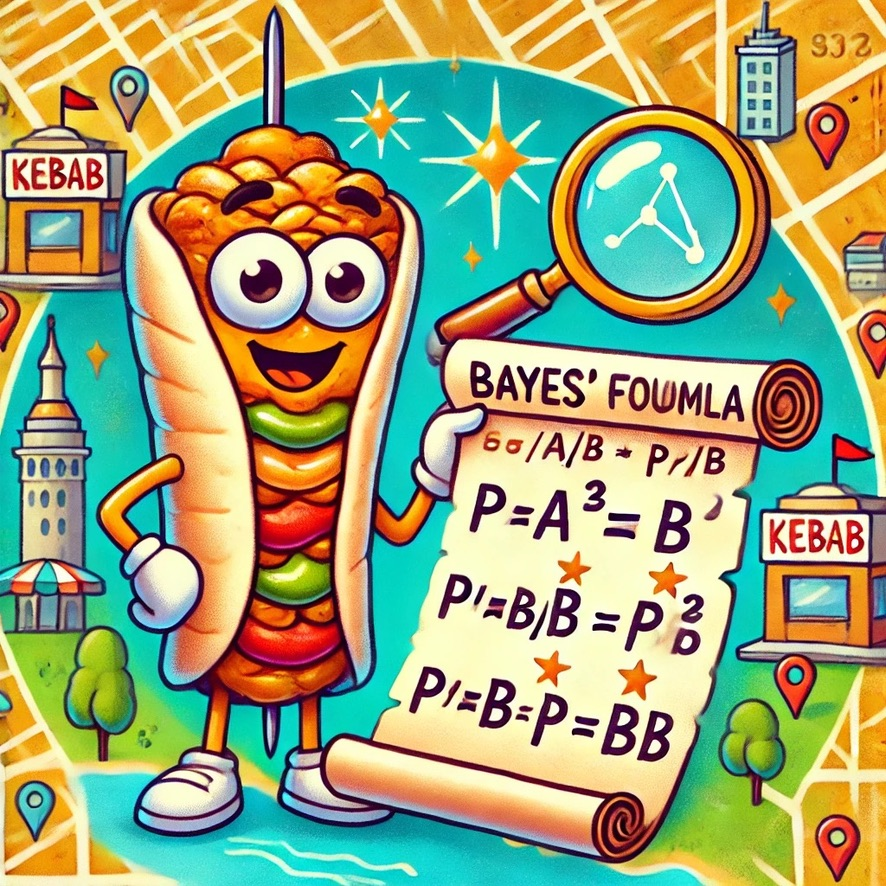

# Kebab ranking by Bayesian average

In this notebook I have implemented a little scraper that takes the restaurant ratings from google maps API, calculate a Bayesian correction to the score and return the updated list.
To do that you will need an API from Google Maps.
